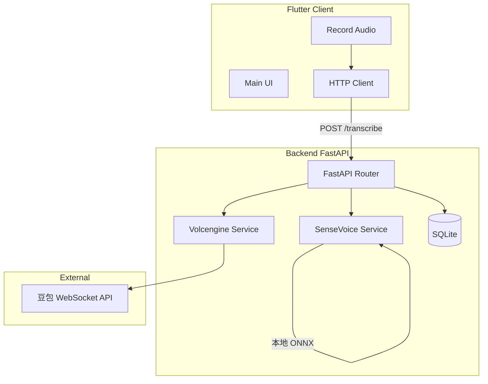

# Backend FastAPI 推理迁移计划

## 架构概览




## 1. Backend 目录结构

```
backend/
├── app/
│   ├── __init__.py
│   ├── main.py           # FastAPI app 入口
│   ├── config.py         # 配置（Pydantic Settings）
│   ├── database.py       # SQLAlchemy engine + session
│   ├── models/           # ORM 模型
│   │   ├── __init__.py
│   │   └── transcription.py
│   ├── schemas/          # Pydantic 请求/响应
│   │   ├── __init__.py
│   │   └── transcription.py
│   ├── services/         # 推理服务
│   │   ├── __init__.py
│   │   ├── volcengine.py # 豆包 WebSocket 调用
│   │   └── sensevoice.py # Sherpa-ONNX 本地推理
│   └── api/
│       ├── __init__.py
│       └── v1/
│           ├── __init__.py
│           └── transcribe.py
├── models/               # SenseVoice 模型文件（model.int8.onnx, tokens.txt）用户放置
├── config/
│   └── volcengine.json.example
├── requirements.txt
└── .env.example
```

## 2. 依赖与配置

**requirements.txt** 核心依赖：

- fastapi, uvicorn[standard]
- sqlalchemy, aiosqlite（或 sqlalchemy 同步 + sqlite3）
- loguru
- python-multipart
- sherpa-onnx（SenseVoice 推理）
- websockets（豆包 WebSocket）
- pydantic, pydantic-settings

**配置**（`app/config.py`）：

- `DATABASE_URL`: 默认 `sqlite:///./byvo.db`
- `VOLC_APP_KEY`, `VOLC_ACCESS_KEY`, `VOLC_RESOURCE_ID`：豆包凭证，从 env 或 `config/volcengine.json` 读取
- `SENSEVOICE_MODEL_DIR`：SenseVoice 模型目录，默认 `models/sensevoice`

## 3. API 设计

### POST /api/v1/transcribe

- **Content-Type**: `multipart/form-data`
- **Body**: `audio` (file, WAV), `engine` (string: `sensevoice` | `volcengine`)
- **Response** (JSON):
  ```json
  {
    "text": "转写结果文本",
    "emotion": "开心",
    "event": null,
    "lang": "zh",
    "engine": "volcengine",
    "id": 1
  }
  ```
- 转写完成后写入 SQLite，返回包含 `id` 的结果

## 4. 推理服务实现

### Volcengine Service（[lib/transcription/volcengine_engine.dart](c:\work\byvo\lib\transcription\volcengine_engine.dart) 逻辑迁移）

- 使用 `websockets` 连接 `wss://openspeech.bytedance.com/api/v3/sauc/bigmodel_nostream`
- Header：`X-Api-App-Key`, `X-Api-Access-Key`, `X-Api-Resource-Id`, `X-Api-Connect-Id`
- 协议：与 Dart 一致（4 字节 header + payload，full client request → audio chunks → 解析 full server response）
- 输入：WAV 文件路径或 bytes，需解析为 16k mono PCM（可用 `scipy` 或 `wave` + 简单重采样）

### SenseVoice Service

- 使用 `sherpa-onnx` Python 包，参考 [sensevoice_engine.dart](c:\work\byvo\lib\transcription\sensevoice_engine.dart) 的参数
- `OfflineSenseVoice`, `OfflineRecognizer` 等 API
- 模型路径：`{model_dir}/model.int8.onnx`, `{model_dir}/tokens.txt`

## 5. 数据持久化（SQLAlchemy + SQLite）

**模型** `TranscriptionRecord`：

- `id` (PK), `engine` (str), `text` (str), `audio_size` (int, 可选)
- `emotion`, `event`, `lang` (nullable)
- `created_at` (datetime)

启动时 `create_all()` 创建表，暂不做迁移工具。

## 6. 日志

- 使用 Loguru，在 `main.py` 中 `logger.add(...)` 配置
- 请求、推理耗时、错误均打日志，格式含 `f"{var=}"` 风格

## 7. 客户端改造

- 新增 `BackendTranscriptionEngine`，实现 `TranscriptionEngine` 接口
- 使用 `http` 或 `dio` 向 `POST /api/v1/transcribe` 上传音频文件
- 后端 base URL：从 SharedPreferences 或设置页配置（默认如 `http://10.0.2.2:8000` Android 模拟器 / `http://localhost:8000` 调试）
- 移除客户端内的 `VolcengineEngine`、`SenseVoiceEngine` 直接推理逻辑，统一走后端
- 豆包配置 UI：可移除或改为「后端地址」配置；豆包凭证仅在后端配置

## 8. .gitignore 补充

- `backend/venv/`, `backend/.env`, `backend/*.db`
- `backend/config/volcengine.json`
- `backend/models/sensevoice/`（模型文件不入库）

## 9. 实施顺序

1. 创建 backend 目录结构、requirements.txt、config
2. 实现 database、models、schemas
3. 实现 Volcengine Service（豆包 Python 版）
4. 实现 SenseVoice Service
5. 实现 FastAPI 路由与 main 入口
6. 客户端：BackendTranscriptionEngine + HTTP 调用，修改 main.dart 使用
7. 更新 .gitignore、README

## 10. 注意事项

- SenseVoice 模型需手动放置到 `backend/models/sensevoice/`，可从现有 `assets/sensevoice/` 复制或重新下载
- 豆包凭证放在 backend 的 `config/volcengine.json` 或环境变量
- 暂不做认证，CORS 可设为 `allow_origins=["*"]` 方便开发
- 实时转写：客户端继续「按块录音 → 每块 POST 转写 → 拼接结果」，无需改动实时逻辑，只是每块请求走后端

